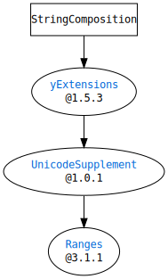

# SwiftStringComposition

`SwiftStringComposition` provides some features that handles `String` as a collection of lines.


# Requirements

- Swift 5.1
- macOS(>=10.15) or Linux

## Dependencies




# Usage

```Swift
import StringComposition


let string = """
#include <stdio.h>

int main(int argc, char* argv[]) {
printf("Hello, world!");
return 0;
}
"""

var lines = String.Composition(string)
lines.shiftRight(1, in: 3...4)
lines.indent = .spaces(count: 4)

print(lines.description)
/*
#include <stdio.h>

int main(int argc, char* argv[]) {
    printf("Hello, world!");
    return 0;
}
*/

```


# License

MIT License.  
See "LICENSE.txt" for more information.


